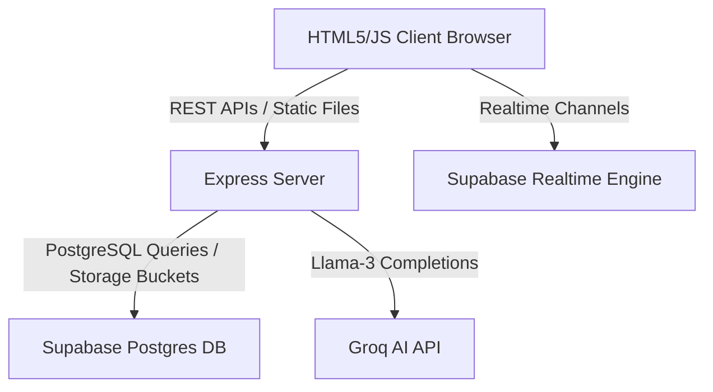
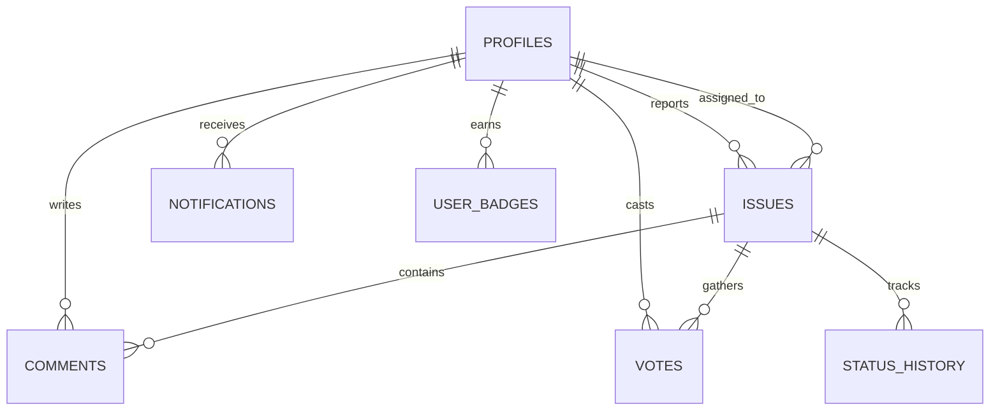

# CrowdCity Platform Architecture

This document describes the architectural design, system boundaries, and implementation patterns used in the CrowdCity civic reporting platform.

---

## 1. System Overview

CrowdCity is a web application designed to enable citizens to report civic hazards (like potholes, streetlights, leakages) and reward community engagement through a gamification system. The backend leverages Express.js on Node.js, and integrates with Supabase (PostgreSQL + RLS + Realtime) for data storage and user authentication.



---

## 2. Directory Layout & Layer Responsibilities

```
crowdcity/
├── client/                 # Frontend SPA Assets (HTML, Vanilla CSS, JS modules)
│   ├── css/                # Aesthetic tokens, layout, styling files
│   ├── js/                 # API controllers, auth adapters, notifications listener
│   └── *.html              # View Pages (index, report, analytics)
├── server/                 # REST API Express Backend
│   ├── config/             # Config helpers (Supabase client init, Winston Logger)
│   ├── controllers/        # Request handlers, transactional business logic
│   ├── middlewares/        # Security headers, rate limiters, input validation schemas
│   ├── routes/             # REST Route mappings
│   └── app.js / server.js  # Server bootstrap, error handlers, and lifecycle hooks
├── supabase/               # Database Schemas & Optimizations
│   ├── schema.sql          # Primary DDL tables, foreign keys, triggers, and RPCs
│   └── indexes.sql         # Query acceleration indexes for production
└── Dockerfile / docker-compose.yml # Containerized hosting pipelines
```

---

## 3. Data Schema & Core Relations



### Table Schema Highlights
* **profiles**: Tied to Supabase Auth (`auth.users`), containing community participation `points` and administrative roles (`citizen`, `authority`, `admin`).
* **issues**: Stores complaint coordinates (`latitude`, `longitude`), categories, and resolution tracking. Augmented by `ai_summary` and `ai_priority` flags generated by Groq.
* **votes**: Employs a unique constraint `unique(user_id, issue_id)` to prevent double-voting.
* **status_history**: Audit log records charting status transitions (e.g., pending -> assigned -> resolved) with validator inspector attachments.

---

## 4. Production Security Practices

### JWT Session Verification
Authentication is validated at the middleware layer (`requireAuth`) via Supabase JWT signature checks. In development mode without variables, the system falls back to mock token injection (`mock-jwt-token-[role]`).

### Input Validation & Sanitization
* All incoming payloads are sanitized by `validationMiddleware.js` which strips out HTML elements to block Cross-Site Scripting (XSS).
* Strict schema validation rejects inputs exceeding string boundaries or coordinate bounds (Latitude must be `[-90, 90]` and Longitude `[-180, 180]`).

### API Rate Limiting
API endpoints are protected by `express-rate-limit`:
* **General Limit**: Maximum 200 requests per 15 minutes per IP.
* **Sensitive Limit**: Maximum 30 requests per 15 minutes on heavy actions (AI analysis `/api/ai/analyze`, chat completor `/api/ai/chat`, and reporting `/api/issues`).

### Secure Headers
`helmet` is integrated to enforce standard security headers, shielding the app from MIME-sniffing, clickjacking, and script injection vector threats.

---

## 5. Performance Optimization Details
* **Gzip Payload Compression**: Express responses are compressed using the `compression` middleware, optimizing network bandwidth utilization.
* **Static Asset Caching**: Client assets (CSS, JS, images) are served with `Cache-Control: max-age=86400` (1 day cache validation window) in production.
* **Database Indexes**: High-usage columns (`reporter_id`, `assigned_to`, `status`, and `issue_id`) are indexed to maintain sub-second response times on joins and queries.
